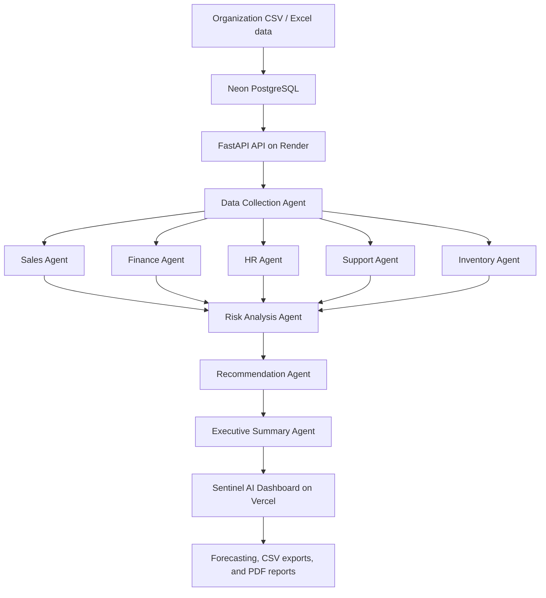
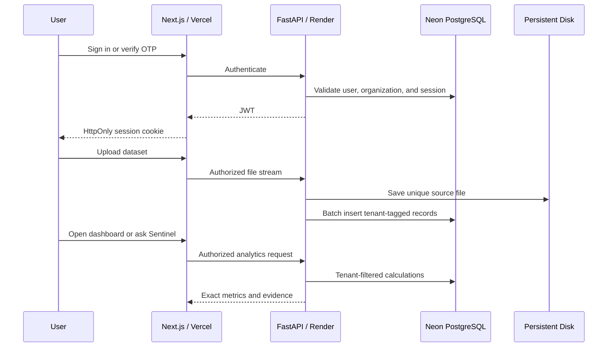

# Architecture

Every request is scoped by the authenticated organization. The API resolves the
JWT to a revocable server-side session and current user, then tenant-filtered
repositories enforce `organization_id` before any data, file, report, or AI
conversation is read or written.

The frontend never stores access tokens in browser storage. Next.js writes the
token to an `HttpOnly`, `Secure` in production, `SameSite=Lax` cookie. Server-side
route handlers relay authorized calls to FastAPI, and middleware gates protected
routes.

Local development is native Windows with SQLite, FastAPI, and Next.js. Production
uses Vercel, Render, Neon PostgreSQL, and a Render persistent disk. Alembic runs as
a pre-deploy command before the new API revision starts.
