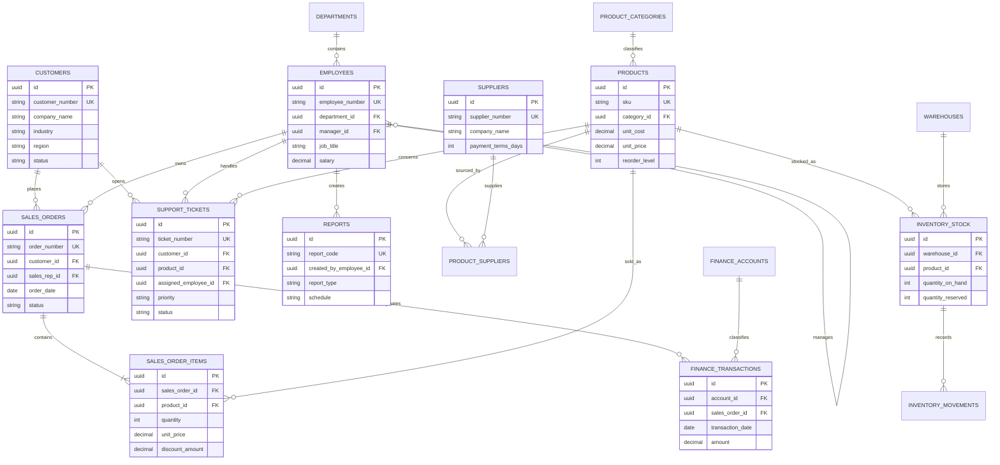

# Sentinel AI business intelligence ER diagram

The design is in third normal form: descriptive entities are stored once, many-to-many supplier sourcing is resolved through `product_suppliers`, order headers are separated from line items, inventory balances are unique per product and warehouse, and finance classification is separated from individual transactions.

